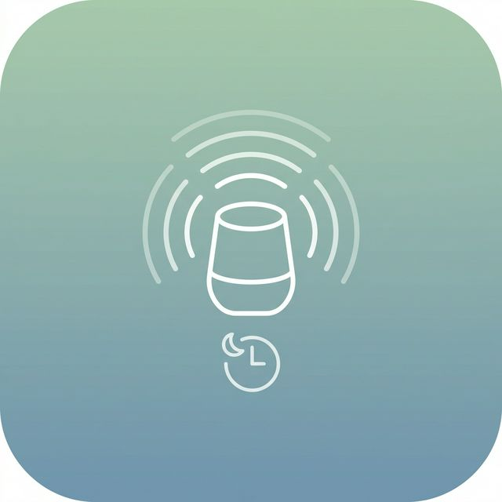
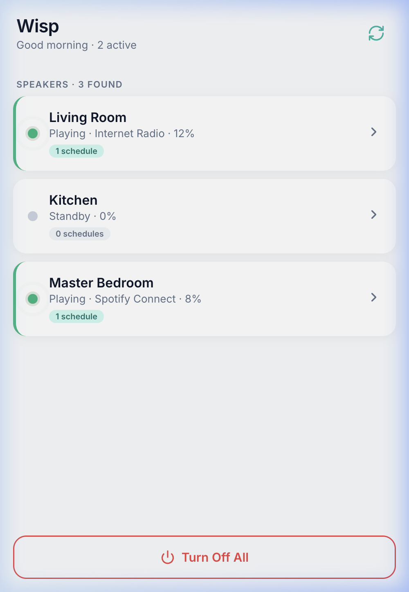
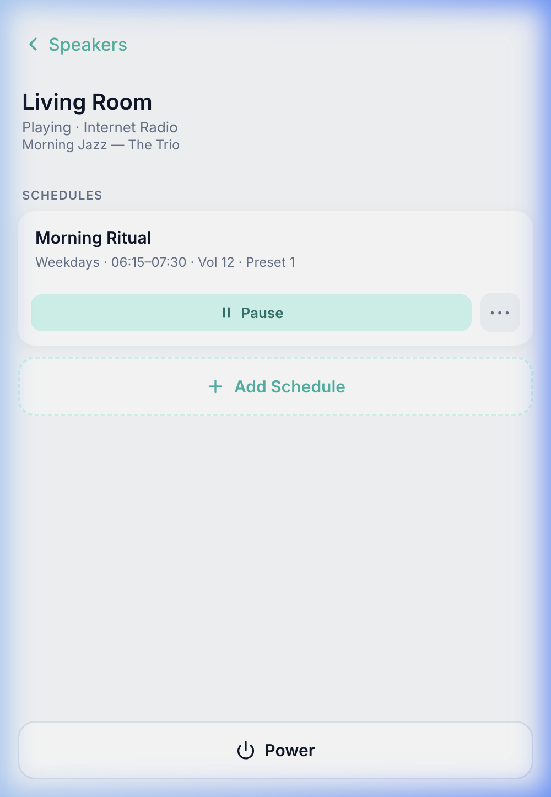
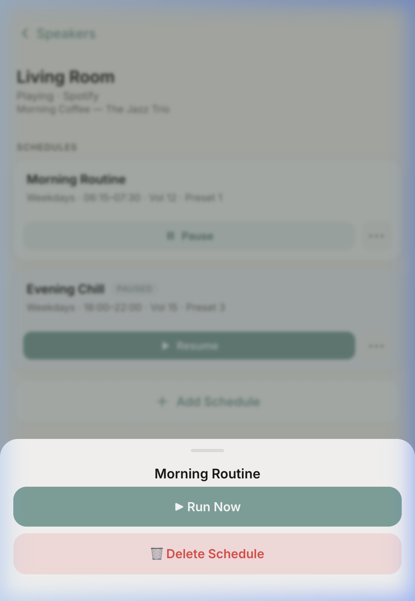
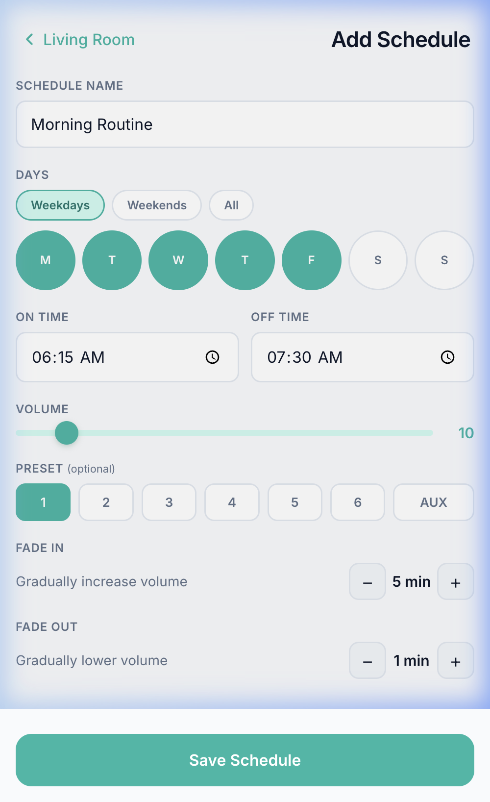

<p align="center">
  
</p>

# Wisp

> **A second life for your Bose SoundTouch home.**

[](https://opensource.org/licenses/MIT)
[](https://www.python.org/downloads/)
[](https://www.docker.com/)

**Home should be a sanctuary, not a source of stress.**

I built **Wisp** for my family because I believe technology should feel like magic. It should stay in the background and simply make life better. I wanted to replace harsh phone alarms with a gentle way to start the day.

When Bose released their API documentation, I saw a chance to give the SoundTouch system a second life. Wisp is the realization of a dream I had when I first purchased it many years ago: a home filled with music that follows the quiet rhythm of our lives, drifting gracefully from the first light of morning to the peace of the night.

---

## 📱 The Experience

*Wisp is built to be seen and then forgotten. Its simple layout handles the hard work so you can focus on the music.*

<table>
  <tr>
    <td width="50%" align="center">
      <br>
      <b>The Hub</b><br>
      <i>Real-time status for your speakers.</i>
    </td>
    <td width="50%" align="center">
      <br>
      <b>Detail View</b><br>
      <i>Manage schedules and precise routines.</i>
    </td>
  </tr>
  <tr>
    <td width="50%" align="center">
      <br>
      <b>The Menu</b><br>
      <i>Quick access to manual triggers.</i>
    </td>
    <td width="50%" align="center">
      <br>
      <b>The Editor</b><br>
      <i>Create gentle fade-in transitions.</i>
    </td>
  </tr>
</table>

---

## ✨ Why Wisp?

Most tools just "turn things on." Wisp is designed to be **polite, precise, and invisible.**

*   🌅 **Sunrise Audio:** Wisp wakes you up slowly with custom fade-in transitions.
*   🤫 **Polite Logic:** Wisp checks if you're already listening to music. It will never interrupt you.
*   📱 **Instant Control:** A fast, mobile Web UI (PWA). Add it to your home screen for a native app feel.
*   🚀 **Performance First:** Built with real-time updates and smart caching for a lag-free experience.
*   🏠 **Privacy Centric:** 100% self-hosted. Your data never leaves your home network.

---

## 🚀 Quick Start (Docker)

Get Wisp running quickly.

```bash
cp deployment/config.json ./config.json

docker run -d \
  --name wisp \
  --network host \
  -v $(pwd)/config.json:/workspace/config.json \
  -p 9001:9001 \
  brisebois/soundtouch-service:latest
```

*Access your hub at `http://<your-ip>:9001`*

---

## 🛠 Features for Power Users

### 📅 Advanced Scheduling
Manage routines across multiple speakers. Pick specific days, set volumes, and define unique fade times for every room.

```json
{
  "Living Room": [
    {
      "name": "Morning Routine",
      "days": ["monday", "tuesday", "wednesday", "thursday", "friday"],
      "on_time": "06:15",
      "off_time": "07:30",
      "preset": 1,
      "source": null,
      "volume": 10,
      "fade_in_duration": 300,
      "fade_out_duration": 60,
      "paused": false
    }
  ]
}
```

### ⏸ Pause & Resume
Life happens. Pause your routines for holidays or vacations with a single tap. Resume whenever you're ready.

### ⚡ Run Now (Manual Trigger)
Need to start a routine early? Trigger any schedule immediately from the UI or API.

---

## 🏗 Performance

Wisp is built to solve common local network audio delays:

1.  **Device IP Cache:** Remembers your speakers to avoid discovery delays.
2.  **WebSocket Sync:** Uses the Bose protocol for instant status updates.
3.  **Safe Persistence:** Saves changes in the background to prevent file errors.

---

Wisp provides a full REST API for advanced users and smart home integrations like Home Assistant. Explore the documentation at `http://<your-ip>:9001/apidocs`.

**Key Endpoints:**
*   `GET /api/discover` — List discovered speakers from the cached discovery layer.
*   `POST /api/<speaker>/schedules/<name>/trigger` — Start a routine manually.
*   `PATCH /api/<speaker>/schedules/<name>/pause` — Toggle holiday/sick-day mode.

The real-time speaker status view also depends on access to the speaker WebSocket endpoint on port `8080`.

---

## 📦 Deployment Note

For best performance on a **Synology NAS**, run the container in **Host Network Mode**. This is required for your speakers to be found automatically.

---

## 🧪 Tested Environments

- Docker with host networking on local LAN.
- Python 3.13+ runtime (container and local development).
- Synology NAS deployment using `deployment/docker-compose.yml`.

---

## ✅ Project Health

- [Contributing Guide](CONTRIBUTING.md)
- [Security Policy](SECURITY.md)
- [Code of Conduct](CODE_OF_CONDUCT.md)
- [Changelog](CHANGELOG.md)

## 🧰 Developer Quality Gates

Wisp enforces lightweight quality checks in CI and supports the same checks locally.

```bash
pip install -r requirements.txt ruff mypy pre-commit
pre-commit install
pre-commit run --all-files
```

Tooling configuration lives in `pyproject.toml` and CI runs the same checks from `.github/workflows/tests.yml`.

## 📄 Config Schema Migration

The scheduler configuration file now uses a versioned document format:

```json
{
  "version": 1,
  "schedules": {
    "Living Room": [
      {
        "name": "Morning Routine",
        "days": ["monday"],
        "on_time": "06:15",
        "off_time": "07:30",
        "preset": 1,
        "source": null,
        "volume": 10,
        "fade_in_duration": 300,
        "fade_out_duration": 60,
        "paused": false
      }
    ]
  }
}
```

Legacy root-level schedule maps are auto-migrated on load. Keep a backup of `config.json` before upgrading in production.

---

*Built with ❤️ for the Bose SoundTouch community.*
